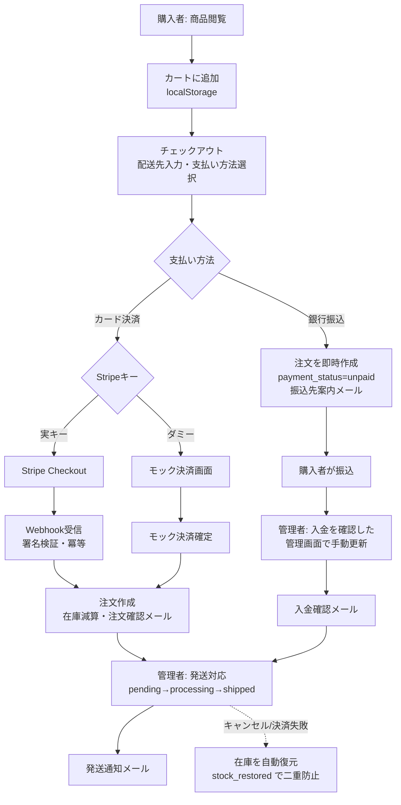
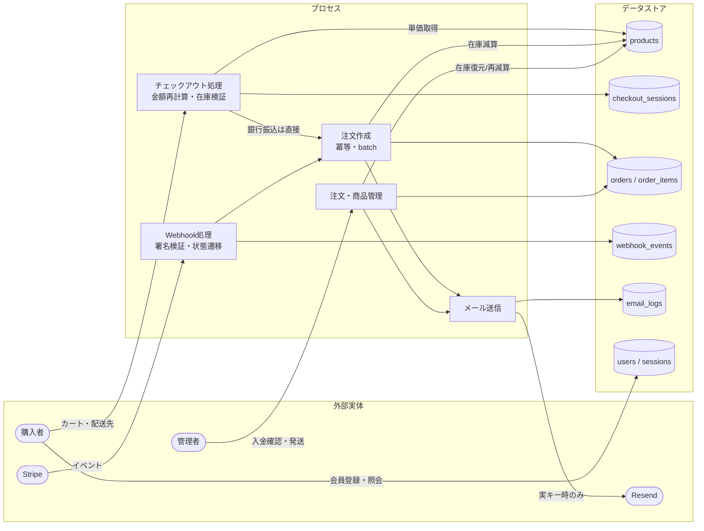
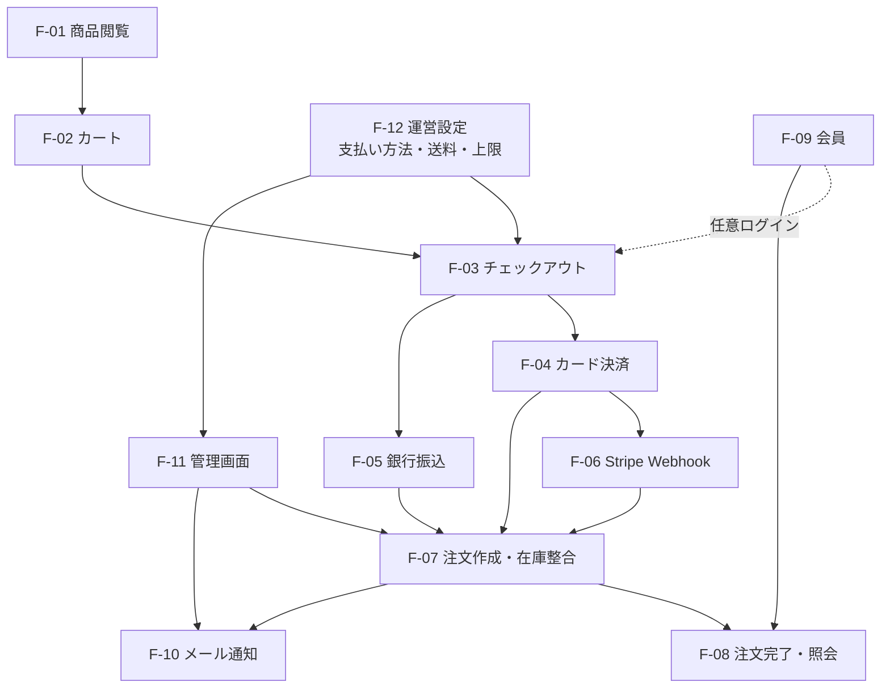

# 業務フロー図・DFD・機能関連図

> **レビュアー向けサマリ**
> - 初版。実装済みフローの図式化（P2逆生成）。レビュー対象は「業務の分岐（支払い方法・入金確認・キャンセル）が実運用の意図どおりか」
> - 人間が判断すべきポイント: (1) 銀行振込の入金確認が管理画面手動のみでよいか (2) キャンセル時の在庫自動復元の業務ルール (3) DFDの外部実体（Stripe/Resend）以外に連携先の予定がないか
> - 影響ID: F-01〜F-12（[要件定義書](requirements.md)）／ AC-05-1・AC-07-3

- 作成日: 2026-07-11 ／ 作成: requirements-analyst（兼務。business-process-analyst はleader兼務のため）
- **人間承認ビジュアル**: [business-flow.html](business-flow.html)（本書からの一方向生成ビュー。レビューはそちらが読みやすい。本書のMermaidが正本）

## 1. 業務フロー図（購入〜発送）

## 2. DFD（データフロー図）

## 3. 機能関連図

