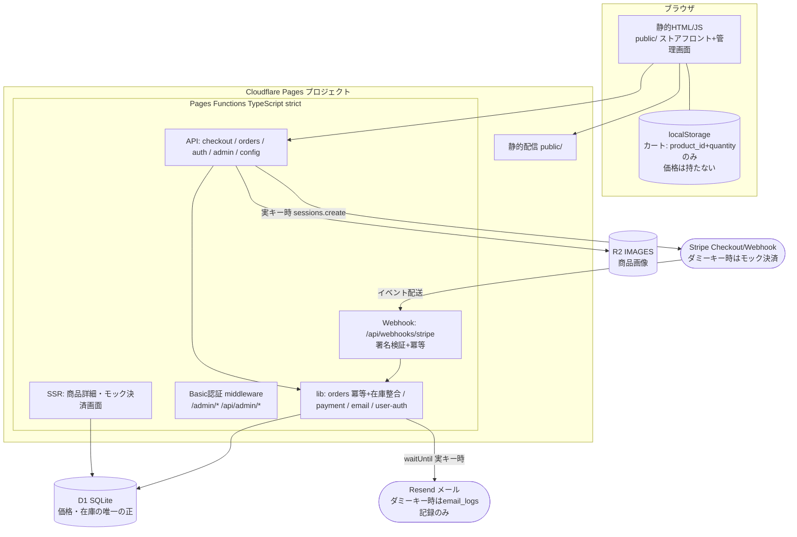
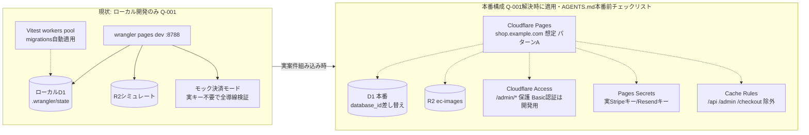

# アーキテクチャ構成図・インフラ（サービス）構成図

> **レビュアー向けサマリ**
> - 初版。実構成の図式化（P2逆生成。新規の構成判断はない）
> - 人間が判断すべきポイント: (1) 本番構成（右図の点線＝未適用: Cloudflare Access・実キー・R2バインディング）がQ-001解決時のTODOとして正しいか (2) 単一Pagesプロジェクト構成（サブドメイン分離パターンA前提）でよいか
> - 影響ID: Q-001（本番展開当面なし）／ AGENTS.md 組み込みパターンA/B

- 作成日: 2026-07-11 ／ 作成: architecture-guardian兼務（infra-coder は保留: Cloudflare Pagesの定型構成のため）
- **人間承認ビジュアル**: [architecture.html](architecture.html)（本書からの一方向生成ビュー。レビューはそちらが読みやすい。本書のMermaidが正本）

## 1. アーキテクチャ構成図（論理）

## 2. インフラ（サービス）構成図（現状=ローカル開発 と 本番TODO）

- 本番適用はすべて人間のみ（`.claude/settings.json` denyで本番系CLIを封鎖済み）
