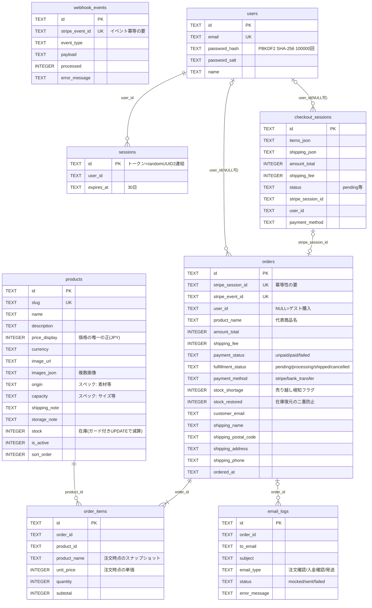

# ERD（データモデル正本）

> **レビュアー向けサマリ**（pack issue #23 試験導入）
> - 初版。migrations 0001〜0005からの復元で**データモデル自体の変更はない**。レビュー対象は「不変条件5点の言語化が正しいか」（末尾の設計上の要点）
> - 人間が判断すべきポイント: (1) 外部キー制約なし（論理参照）の現状を正として固定してよいか (2) 不変条件1〜5に漏れがないか
> - 影響ID: 以後のテーブル変更は本書の先行更新が必須（CLAUDE.mdオーケストレーション原則）

- 管轄: **data-model-specialist（独占管轄。テーブル定義の変更は本書を先に更新してからmigrationを書く）**
- 作成日: 2026-07-11（migrations/0001〜0005 からの復元）
- D1(SQLite)。外部キー制約は張っていない（論理参照。破線は論理リレーション）

## 設計上の要点（変更時に壊してはいけない不変条件）

1. **価格の正は `products.price_display` のみ**。`order_items.unit_price` は注文時点のスナップショット
2. **冪等性**: `orders.stripe_session_id` UNIQUE ＋（注文INSERT・明細INSERT・在庫減算UPDATE）の同一D1 batch
3. **イベント冪等**: `webhook_events.stripe_event_id` UNIQUE
4. **在庫整合**: 減算はガード付きUPDATE（`stock >= ?`）。失敗時は `orders.stock_shortage=1`。復元は `stock_restored` で二重防止
5. `ordered_at` はISO 8601（T区切り）。`datetime('now')` はスペース区切りになり日付絞り込みが壊れるため使わない

## 変更履歴

| 日付 | migration | 変更 |
|---|---|---|
| （導入前） | 0001〜0005 | 初期スキーマ／会員・メール／stripe_price_id廃止／在庫整合フラグ／送料列 |
| 2026-07-11 | — | 本書を実スキーマから復元（データモデル変更なし） |
