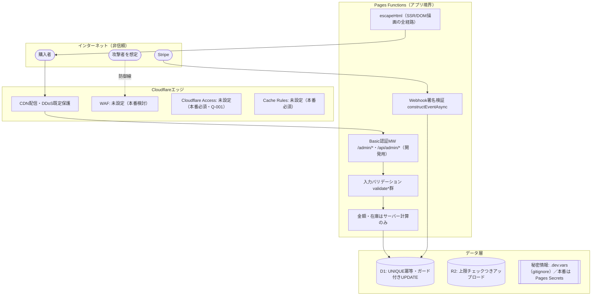

# セキュリティ構成図・攻撃面一覧（正本）

> **レビュアー向けサマリ**
> - 初版（pack issue #32 試験導入）。管轄: security-compliance。「どこが信頼境界で、何で守られていて、**何が守られていないか**」を1枚で判断できることが目的
> - 人間が判断すべきポイント: (1) **未適用の保護**（WAF・レート制限・Access・メール所有確認）の受容可否（§3） (2) 攻撃面一覧の認証なしエンドポイント群の妥当性（§2） (3) Q-09判定（Critical/High 0件）の根拠として本書を使うことの承認
> - 影響ID: Q-001（本番TODO群の根拠）／ I-001（受容済み）／ AC-06・AC-08・AC-09・AC-11
> - **人間承認ビジュアル**: [security-architecture.html](security-architecture.html)（一方向生成ビュー。レビューはそちらが読みやすい）

- 作成日: 2026-07-11 ／ 作成: security-compliance（兼務運用）

## 1. 信頼境界図

## 2. 攻撃面一覧（公開エンドポイント × 防御 × 検証トレース）

| API | 認証 | 入力検証・防御 | 残リスク | 検証（AC/テスト） |
|---|---|---|---|---|
| GET /api/config | なし（公開仕様） | 公開してよい設定のみ返す（支払い方法・振込先） | — | payment.test.ts |
| POST /api/checkout | なし | バリデーション＋金額はD1再計算＋分割明細合算の在庫検証 | レート制限なし（§3） | AC-03-1/2・checkout.test.ts |
| POST /api/mock-checkout/complete | なし | **実キー設定時はモック経路自体が無効化** | モックモードは開発専用 | payment.test.ts |
| POST /api/webhooks/stripe | Stripe署名 | 署名検証・イベント冪等・セッション冪等 | — | AC-06-1〜4・webhooks-stripe.test.ts |
| GET /api/orders/by-session | なし | 個人情報は氏名のみ返す（情報最小化） | session_id持参者は閲覧可（URL共有リスクは受容） | AC-08-2 |
| POST /api/orders/lookup | なし | 注文番号+メール完全一致・存在有無を区別しないnot_found | — | AC-08-1 |
| /api/auth/*（登録・ログイン） | なし（入口） | PBKDF2(10万回)・セッションCookie HttpOnly/SameSite=Lax | パスワードリセットなし（機能欠落として認識済み） | AC-09-1/3・user-auth.test.ts |
| GET /api/account/orders | Cookie必須 | セッション検証 | **I-001**: メール所有確認なし（受容済み） | AC-09-2 |
| /api/admin/*・/admin/* | Basic認証 | 商品バリデーション・上限チェック | **開発用の簡易保護**。本番はAccess必須（Q-001） | AC-11-1〜3・product-validation.test.ts |

## 3. 未適用の保護（検討漏れではなく明示的な判断）

| 保護 | 状態 | 判断・復活条件 |
|---|---|---|
| WAF | 未設定 | 未本番のため。実案件組み込み時にCloudflare WAF（マネージドルール）の有効化を本番前チェックリストへ追加検討 |
| レート制限 | なし | 小規模EC想定・未本番のため受容。本番でcheckout/lookup/authへのRate Limiting Rulesを検討 |
| Cloudflare Access | 未設定 | Q-001（本番展開なし）。**本番前チェックリスト4で必須** |
| Cache Rules | 未設定 | 同上（チェックリスト5） |
| メール所有確認 | なし | I-001でリスク受容済み（実運用開始時に解消） |
| CSP/セキュリティヘッダ | 未設定 | XSSはescapeHtmlで一次防御。多層化は本番時に検討 |

## 4. 何が漏れたらやばいのか（データ資産分類）

データ資産の棚卸し・漏洩インパクト分類（現状／本番運用時の対比）は [ai-dev-security.md §2](../10-management/ai-dev-security.md) を正本とする（二重管理しない）。
本システム観点の要点のみ: **本番運用時に最も守るべきは orders テーブルの顧客個人情報（氏名・住所・電話・メール）と実APIキー**。現状はどちらも存在しない（架空サンプル・ダミーキーのみ）。

## 5. 認証情報の管理（何が・どこに・誰から見えるか）

| 認証情報 | 置き場 | 誰から見えるか | 秘匿の実態（正直に） |
|---|---|---|---|
| Stripe/Resend APIキー | `.dev.vars`（ローカル・gitignore） | **開発マシンにログインできる者・そのマシン上の全プロセス**（平文ファイル。OSレベルの暗号化なし） | AIはdenyで読めないが、**denyはClaude Codeにしか効かない**。npmスクリプト等の他プロセスは読める → だから「実キーをここに置かない」（現状ダミーのみ）が本質の防御 |
| 同・本番用 | Cloudflare Pages Secrets | **設定後は誰からも再表示不可**（write-only。ダッシュボードでも値は見えない） | 本番の正規の置き場。開発マシンには一切置かない（AGENTS.md） |
| 管理画面 Basic認証 | wrangler.toml `[vars]`（**平文コミット**） | 全世界（Publicリポ） | **意図的な非秘匿**（開発用ダミー admin/admin1234）。本番はAccess化＋変更が必須（Q-001・本番前チェックリスト4） |
| 会員パスワード | D1 `users.password_hash` | DBにアクセスできる者（現状ローカルのみ） | 平文は保存しない設計（PBKDF2 SHA-256 10万回＋salt）。DBが漏れても直ちに平文は割れない |
| セッショントークン | D1 `sessions`＋Cookie | Cookie: HttpOnly（JSから読めない）・SameSite=Lax | production時のみSecure。有効期限30日 |
| Cloudflare/GitHubアカウント | 開発者のブラウザ・gh CLI認証 | 開発者本人 | AIはghの既存認証を利用（トークン値自体は扱わない）。アカウント保護は人間側の責務（2FA推奨） |

- **「見てはいけない人」の整理**: 現状1人体制のため人間同士のアクセス分離は存在しない。分離しているのは (1) AI vs 人間（deny） (2) リポジトリ閲覧者 vs 実キー（実キーはリポジトリに存在しない） (3) 本番Secrets vs 全員（write-only）。複数人体制になったら `.dev.vars` の配布手順と権限分離を運用設計に追加する（operations-designer復活条件）

## 6. 秘密情報の置き場と流れ

- ローカル: `.dev.vars`（gitignore済み・AIは読み取りdeny）／ 本番: Cloudflare Pages Secrets（開発マシンに置かない）
- リポジトリ（Public）: ダミー値のみ許可。混入は `tools/audit_pack.py` の混入検査＋レビューで検出
- 価格・在庫・注文: D1のみが正。フロント・localStorageは識別子と数量のみ保持
