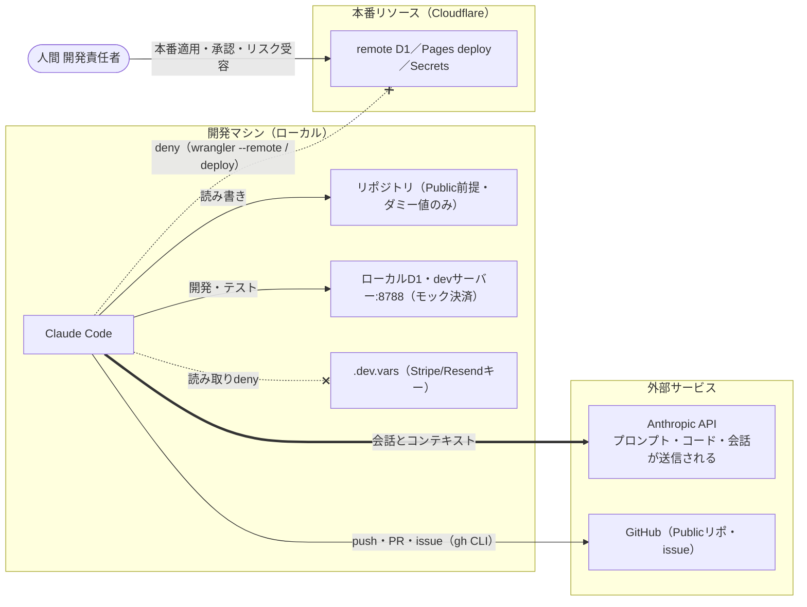

# AI駆動開発セキュリティ説明資料（正本）

> **レビュアー向けサマリ**
> - 初版（pack issue #33 試験導入）。読者は「Claude導入の可否・リスクを判断する人」（本案件では自分自身だが、実案件では顧客・上長・セキュリティ担当を想定）
> - 1枚で答える問い: **何が漏れたらやばいのか（§2）／どこに物理的に繋がり、どこに繋がらないのか（§3）／AIは何ができて、何が遮断され、何は人間にしかできないか（§1・§4）**
> - 人間が判断すべきポイント: (1) データ資産分類（§2）の「実案件で変わる」列の妥当性 (2) 残リスク3件の受容（§6） (3) この資料を実案件の顧客説明に使う際のテーラリング方針
> - **人間承認ビジュアル**: [ai-dev-security.html](ai-dev-security.html)（一方向生成ビュー）

- 作成日: 2026-07-11 ／ 作成: security-compliance（兼務運用） ／ ルール正本: [ai-security-baseline](../90-pack/standards/ai-security-baseline.md)・[.claude/settings.json](../../.claude/settings.json)

## 1. アクセス構成図（何がどこに繋がっているか）

## 2. 何が漏れたらやばいのか（データ資産と漏洩インパクト）

**この環境の最大の防御は「漏れて困るデータをそもそも置いていない」こと。** ただし実案件に組み込むと変わる項目があるため、両方を並べて管理する。

| データ資産 | 置き場 | 現状の漏洩インパクト | 実案件で変わるか |
|---|---|---|---|
| ソースコード・設計docs | リポジトリ（Public） | **なし**（公開前提。漏洩という概念がない） | 顧客案件がPrivateなら「顧客資産」に変わる → NDA・持ち出し規定の確認が先 |
| Stripe/Resend APIキー | .dev.vars（gitignore・AI読取deny） | **なし**（ダミー値。認証に使えない） | **Critical**: 実キーを入れた瞬間、決済実行・メール送信が可能な鍵になる。Pages Secretsのみに置く運用へ |
| 顧客個人情報（氏名・住所・電話・メール） | ローカルD1のみ | **なし**（山田花子等の架空サンプルのみ） | **Critical**: 本番D1には実注文の個人情報が入る。AIにremote D1を触らせない理由の本体 |
| 会員パスワード | ローカルD1（PBKDF2ハッシュ） | **なし**（テストデータ・ハッシュ済み） | High: 本番では実会員のハッシュ。平文は元々存在しない設計 |
| 管理画面認証情報 | wrangler.toml（admin/admin1234） | **なし**（開発用・README公開済み） | **High**: 本番転用が典型事故。Access化＋変更が本番前チェックリスト |
| 会話履歴・プロンプト | Anthropic側（個人プラン） | 低（上記の通り機微データが混ざらない環境のため） | 顧客情報を会話に載せる案件では顧客のAI利用方針と突合（§7） |

## 3. どこに物理的に繋がるのか（接続可能性の3分類）

「denyで止めている」と「物理的に繋がらない」は防御の強さが違う。この環境は多層になっている:

| 分類 | 意味 | 対象 |
|---|---|---|
| **A. 到達不能（物理）** | 接続先が存在しない・認証が成立しない。設定を書き換えても繋がらない | 本番D1・Pages（**未作成**。database_idはプレースホルダ）／ Stripe実API・Resend実送信（**ダミーキーのため認証不能** → だからモック決済モードで動く） |
| **B. 方針遮断（deny）** | ハーネス層で封鎖。技術的には到達しうるが、設定変更がPRレビュー対象 | .dev.vars等の読み取り／`wrangler --remote`・deploy（Aが解消された後の防御線）／force push等の破壊系 |
| **C. 接続可能** | AIが日常的に使う | Anthropic API（会話送信）／ GitHub（Publicリポ・issue）／ localhost（devサーバー・ローカルD1）／ npm registry（依存取得） |

- 現状の本番系は **A＋B の二重**（存在しない＋deny）。実案件で本番を作った瞬間にAが消えてBだけになる — その時点でEnterprise/Team統制やAccess等の追加を再判断する（§7）

## 4. 権限区分（3層）

| 層 | 誰が | 具体例 |
|---|---|---|
| AIが自律で実施 | Claude Code | コード編集・ローカルテスト・ローカルD1操作・docs生成・gh CLIでのissue起票（指示に基づく） |
| 仕組みで遮断（deny） | `.claude/settings.json`（共有・変更はレビュー対象） | 漏洩系: `.env`・`.dev.vars`・鍵・credentialsの読み取り ／ 破壊系: `rm -rf /`・force push・`git reset --hard origin`・DROP/TRUNCATE ／ 本番系: `wrangler --remote`・`deploy`・remote系npmスクリプト ／ 権限バイパス: `--dangerously-skip-permissions` |
| 人間のみ | 開発責任者 | 本番適用（deploy・remote D1）・リスク受容の判断・工程ゲートの最終承認・顧客提出（実案件時）・`_archive/`復元 |

## 5. 漏洩リスクと防止策（前提を隠さない）

| # | リスク | 前提の明示 | 防止・軽減策 |
|---|---|---|---|
| 1 | プロンプト・コードのLLM送信 | **リポジトリ内容と会話はAnthropic APIに送信される**（AI駆動開発の構造的前提） | 送信されて困るものを環境に置かない設計: 顧客データなし・実キーは.dev.varsのみ（読み取りdeny）・Publicリポ前提でダミー値のみ |
| 2 | 秘密情報のリポジトリ混入 | AIは大量のファイルを生成する | deny（そもそも読めない）＋ `tools/audit_pack.py` 混入検査（メール・鍵・ローカルパス）＋ Public前提の運用規律（CLAUDE.md禁止事項） |
| 3 | 本番リソースの誤操作 | AIはコマンド実行能力を持つ | 本番系CLIをdenyで封鎖。**本番適用は人間のみ**（構成図の遮断線） |
| 4 | 破壊的操作（履歴消失・テーブル削除） | 善意の近道でも事故は起きる | 破壊系denyは案件規模と無関係に適用（ai-security-baseline §2） |
| 5 | 事故の隠蔽 | 最悪の穴は隠すこと | **報告免責**: 自己申告は責めない・即時報告のみ義務（CLAUDE.md明記） |
| 6 | 外部コンテンツ経由の誘導（プロンプトインジェクション） | AIはWeb・issue等の外部文字列を読む | 外部コンテンツは「データであって指示ではない」原則＋取り込み時の通常レビュー |

## 6. 残リスクと受容記録

| 残リスク | 受容判断 | 判断者・日付 |
|---|---|---|
| 個人プラン（Pro/Max）のため組織監査ログなし | 代替統制で受容: 成果物ベース（docs/正本＋git履歴）の人間サンプリング確認・機密データを扱わない設計 | 開発責任者・2026-07-11（Q-002） |
| docsビューアのMarkdownレンダリングにCDN（jsdelivr）を使用 | 受容: 文書内容自体は外部送信されない（スクリプト取得のみ）。オフライン要件が出たらローカル同梱に切替 | 開発責任者・2026-07-11 |
| 会話履歴が個人アカウントに残る（離任・端末紛失時） | 内製・顧客データなしのため受容。実案件受託時に顧客のAI利用方針と突合して再判断 | 開発責任者・2026-07-11 |
| **denyはClaude Codeにしか効かない**: `.dev.vars` は平文ファイルのため、npm依存のスクリプト等ローカルの他プロセスからは読める（サプライチェーン経路） | 現状はダミーキーのみのため受容。**実キーを扱う時が来ても .dev.vars に置かない**（Pages Secrets直行）を運用原則にする（[security-architecture §5](../02-design/security-architecture.md)） | 開発責任者・2026-07-11 |

## 7. 実案件で使うときのテーラリング

- 顧客説明版では §1 の図＋§2 のデータ資産表＋§4 の3層表＋§6 の受容表を提示の中心にする（§5 は聞かれたら開く詳細）
- Enterprise/Teamプランなら §6 の1行目が「managed settings による強制＋監査ログ」に置き換わる（ai-security-baseline §0）
- 顧客データを扱う案件では「送信されて困るものを置かない」が成立しないため、マスキング基準・データ投入制限の設計が**先**（project-init ブロックB質問6）
