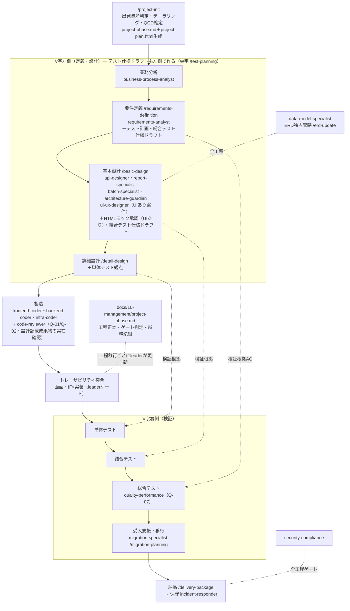
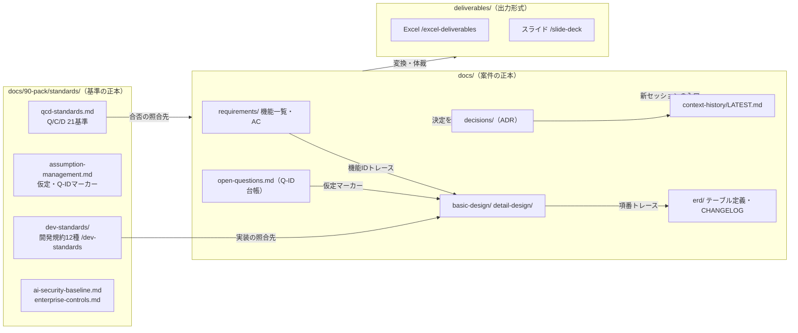
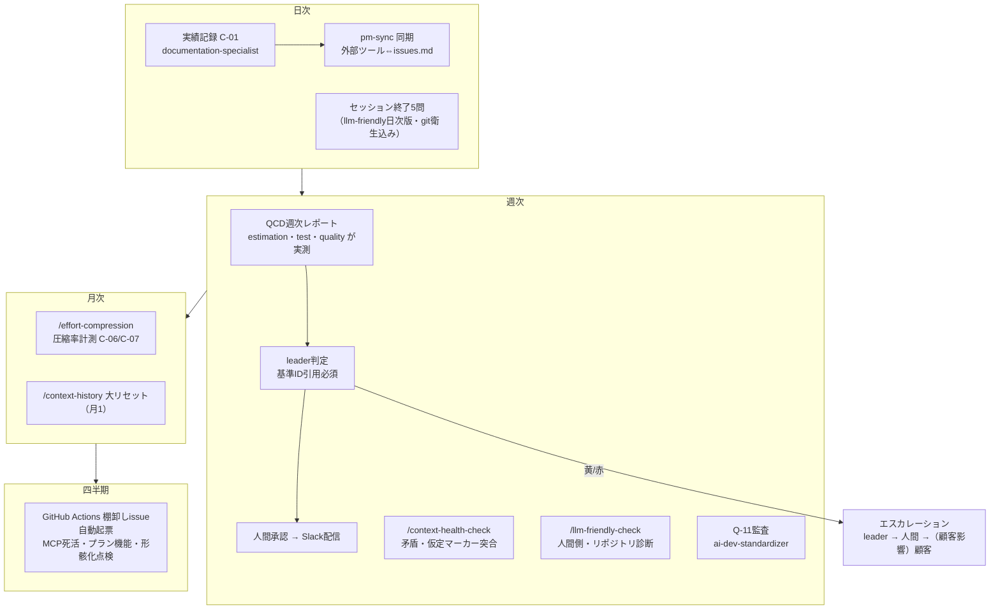
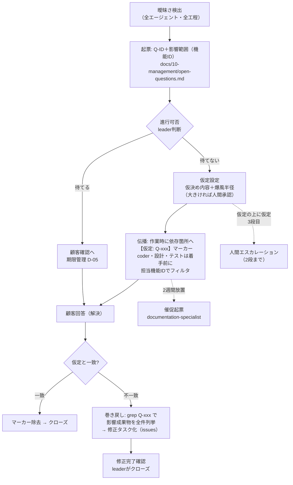

# フローマップ（全体地図）

パックの構成要素がどう連なるかをMermaidで図示する。**個々の定義の正本は各ファイルであり、この図は読むための地図**（矛盾したら各ファイルが正）。

## 1. 工程フロー × エージェント × スキル（V字＋シフトレフトのW字運用）

## 2. ドキュメント正本フロー（誰が作り、誰が照合するか）

## 3. 運用ループ（日次・週次・月次・四半期）

## 4. 仮定（曖昧さ）のライフサイクル

## 図の保守ルール

- 構成要素（エージェント・スキル・標準）を追加/削除したら、この図も同じPRで更新する（consistency.yml の数量チェックが崩れたら図も疑う）
- 図と各定義ファイルが矛盾した場合は**定義ファイルが正**。図を直す
